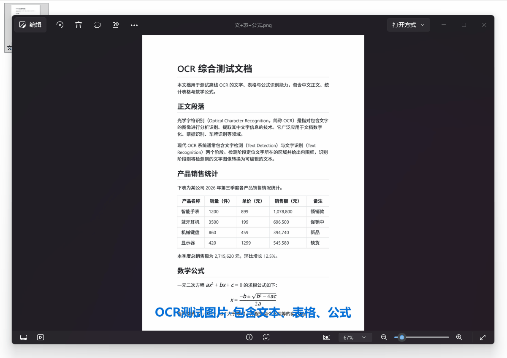

# BmOCR(不忙OCR)

> 基于 RapidOCR (PP-OCRv6) 文字识别 + PP-DocLayoutV3 版面分析 + RapidTable 表格重建 + PP-FormulaNet_plus-M 公式识别的离线图片文字识别工具。支持批量识别、版面结构还原（标题/正文/表格/图片/公式）、检测框可视化，一键导出 Markdown / Word / TXT / JSON / Excel。AI 模型由「不忙脚本盒子」统一下载管理，脚本本身不含模型。

---

## 核心特性

- **离线识别**：RapidOCR PP-OCRv6 引擎，本地 CPU 推理，无需联网、不上传图片
- **版面分析**：PP-DocLayoutV3（24 类版面元素），还原标题、正文、表格、图片、公式等结构，并据此重排阅读顺序
- **表格重建**：RapidTable (SLANetPlus) 独立表格结构模型，正确还原表头、行、列与单元格；小表复用全文 OCR 提速，大表自动缩放重建保证完整；输出 Markdown / Word / Excel 表格（Excel 支持合并单元格）
- **公式识别**：PP-FormulaNet_plus-M（PP-FormulaNet_plus 系列最高精度档，En-BLEU 91.45%），版面检出的公式区域识别为 LaTeX（`$$...$$`），可按需开启
- **检测框可视化**：自动保存带文字检测框的标注图（可开关）
- **多格式导出**：Markdown / Word / TXT / JSON / **Excel**（每个表格一个 sheet，精确还原行列；非表格文本入「文本」sheet）；Word 中的公式会转成可编辑的 Word 原生公式（OMML），不是纯文本粘贴的 LaTeX
- **批量处理**：一次选中多张图片逐个识别，支持多核并行（可配并行数），结果与源图同目录输出（`原文件名_ocr` 后缀）
- **自动预处理**：可选手动或「自动」模式，低对比度/低质量图自动增强
- **定时任务**：配置好图片与参数，到点自动静默识别
- **节点联动**：可被其他脚本调用，返回识别文本、坐标与表格单元格结构

---

## 脚本演示




---

## 安装方法

本脚本的运行环境、依赖组件及图形化窗口均依赖"不忙脚本盒子"，建议仅通过盒子安装和使用本脚本。

> 前置条件：安装好 [不忙脚本盒子](https://www.bm-box.cn)

* 打开盒子 → **脚本市场** → 搜索 **「离线OCR」**
* 点击「安装」——盒子会自动下载所需的 AI 模型），请保持网络畅通


---

## 使用方式

### 直接启动

* 在盒子里点击脚本卡片，弹出**运行设置窗口**
* 点击「源文件」右侧的文件选择器，选择要识别的图片（可多选）
* 按需调整参数：检测阈值、预处理、导出格式、检测框可视化
* 点击「执行」，完成后在图片所在目录查看 `_ocr.md` / `_ocr.docx` 等结果文件

### 右键启动

* 在文件管理器中选中一张或多张图片（支持 png/jpg/jpeg/bmp/tiff/webp）
* 右键 → 选择 **「离线OCR」**
* 盒子弹出运行窗口并预填所选图片，调整参数后点「执行」

### 定时任务

* 打开盒子 → **定时任务** → 新建任务 → 选择 **「离线OCR」**
* 在表单中填写源文件与识别参数（阈值/预处理/导出格式），设置触发时间
* 到点自动在后台识别，结果写入图片同目录，执行记录显示成功/失败

### 参数说明

| 参数 | 说明 |
| --- | --- |
| 版面分析 | 启用 PP-DocLayoutV3 版面分析（还原标题/表格/图片/公式结构）；关闭则仅纯文本排版，且不加载版面模型，速度更快 |
| 版面阈值 | 版面区域检测置信度阈值（0.1-0.9），仅版面分析开启时生效 |
| 检测阈值 | OCR 文本检测置信度阈值（0.1-0.9），越低识别越多、误检也越多 |
| 预处理 | 无 / 自动(低对比度自动增强) / 灰度化 / 二值化 / 降噪 / 增强对比度 |
| 导出格式 | Markdown / Word / TXT / JSON / Excel（表格图推荐，自动拆分为多个 sheet） |
| 检测框可视化 | 开启时额外保存带绿色文字检测框的 `_ocr_boxes.png` 标注图 |
| 公式识别 | 将版面检出的公式区域识别为 LaTeX（按需开启，单条约 1-2 秒） |
| 并行数 | 批量处理并行数，0=自动（不超过 4 个线程，也不超过图片数），1=串行，最大 8 |

---

## 节点脚本(开发者阅读)

本脚本声明为节点，可被其他盒子脚本通过 `/api/link` 调用。返回业务键：

| 业务键 | 类型 | 说明 |
| --- | --- | --- |
| `results` | list | 各图片导出的结果文件路径列表 |
| `text` | str | 合并后的 Markdown 识别文本 |
| `ocr_data` | list | 逐图 OCR 结构化结果：`[{image, items:[{text, score, box, points}], tables:[{bbox, cells:[{row, col, text, box}]}]}]` |

联动调用示例：

```python
import json, sys, requests

payload = json.load(open(sys.argv[1], encoding="utf-8"))
api_base = payload["environment"]["api_base"]

OCR_ID = "e8a3c1d0-6b4f-4a7e-9c2d-5f1e8b3a7d0c"  # 本脚本 script_id

r = requests.post(f"{api_base}/api/link", json={
    "script_id": OCR_ID,
    "data": {"target_paths": ["C:/scan.png"]},
    "params": {"export_format": "Markdown", "box_thresh": 0.5},
}, timeout=3600)
body = r.json()

if not body.get("success"):
    raise RuntimeError(body.get("message", "联动调用失败"))

result = body["result"]
if result.get("code") != 0:
    raise RuntimeError(result.get("msg"))

text = result["text"]           # 识别出的 Markdown 文本
out_files = result["results"]   # 导出文件路径列表
entry = result["ocr_data"][0]   # 首图结构化结果
for it in entry["items"]:
    print(it["text"], it["box"])        # 文本 + [x1, y1, x2, y2]
for t in entry.get("tables", []):       # 表格单元格（含坐标/行列号）
    for c in t["cells"]:
        print(c.get("row"), c.get("col"), c.get("text"), c["box"])
```

---

## 💡 使用提示

* 批量识别运算量较大，建议先关闭其他大型应用
* 只需纯文本时可关闭「版面分析」，跳过版面模型加载，识别更快
* 版面结构还原不准确时，可调高「版面阈值」过滤低置信度区域
* 表格区域会自动裁剪并用 RapidTable 重建，无需额外设置
* 识别公式时：开启「公式识别」即可，Markdown 输出 `$$...$$`，Word 输出**可编辑的 Word 原生公式**，Excel/文本 sheet 以 LaTeX 行出现
* Word 公式走 LaTeX → MathML → OMML 转换（纯 Python，无需本机装 Office）；若 `latex2mathml` / `mathml2omml` 缺失或转换失败，会退化为插入 LaTeX 原文，公式内容不会丢
* 选择「Excel」导出时，每个检测到的表格写入独立 sheet（按行列精确放置），图内标题/说明等文本放入「文本」sheet
* 导出格式选 JSON 时，节点返回的 `text` 为空，请直接使用 `results` 中的 JSON 文件或 `ocr_data`
* 识别效果不佳时，优先尝试「增强对比度」预处理，再调低检测阈值
* 方向校正采用**整页投票**。PP-OCR 的方向分类器是 0°/180° 二分类，对短文本行（三两个字）存在误判概率，而它一旦判错就会把正立的行真的旋转 180°，导致漏字甚至数字错位（实测出现过「显示器」→「器」、「备注」整格丢失、「300mg」→「30mg」）。本工具改为统计整张图被判倒转的行占比，占比过低时视为零星误判、不执行旋转 —— 既消除了误判，又保留了处理真正倒转图片的能力
* 本工具**不做整页旋转**。若原图整体倒置，每一行文字会被逐行转正，但行的阅读顺序仍按图像坐标排列，段落顺序和表格行序会颠倒。遇到整体倒置的图片，建议先转正再识别
* **在盒子外直接跑 CLI 时**（无 `BM_API_BASE`），脚本拿不到盒子下发的模型路径，会自动退回各识别库自带的按需下载（模型落到用户缓存目录，不会写进脚本目录）。日常使用建议始终通过盒子运行


---

## 🖥️ 环境要求

| 项目 | 要求 |
| --- | --- |
| **操作系统** | Windows 10+（64 位） |
| **运行环境** | Python 3.10+（由盒子自动管理） |
| **版面模型** | PP-DocLayoutV3（约 131 MB，安装脚本时由盒子自动下载） |
| **公式模型** | PP-FormulaNet_plus-M（约 594 MB，安装脚本时由盒子自动下载） |
| **表格模型** | SLANetPlus（随 Python 包自动下载，约 8 MB） |
| **公式转 Word** | latex2mathml + mathml2omml（由盒子自动安装，纯 Python，不需要 Office） |
| **Excel 支持** | openpyxl（由盒子自动安装） |